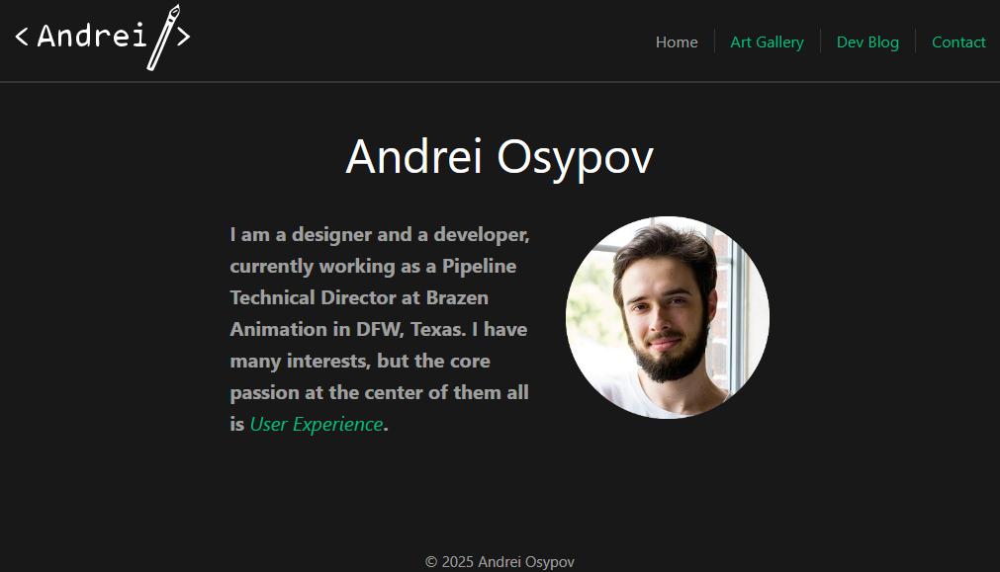

# Andrei Osypov Website




This repo is meant to host my [personal site](https://andreiosypov.github.io/). The primary goals of the site are:

- To show my capabilities in UI/UX, particularly in the use of Javascript, HTML, and CSS.
- To host my resume, art gallery, games gallery, and dev blog.
- To continue developing my dev skills.

<!-- omit in toc -->
## Table of Contents

- [Setup](#setup)
- [Framework](#framework)
- [Dev Goals](#dev-goals)


## Setup

Please refer to the [Setup document](docs/setup.md) for detailed instructions on how to setup the dev environment.

Once the environment has been set up, run the following command to get a local deployment of the site:

```bash
$ npm run dev
```

## Framework

Vue is the framework that the site currently runs in. This framework was chosen due to my work experience with it at Brazen Animation.

The [previous site](https://github.com/andreiosypov/andreiosypov.github.io-React) ran on React due to my experience with it at Xrathus Inc., but I have enjoyed using Vue more than React. More details [here](https://andreiosypov.github.io/devblog/react-vs-vue).

## Dev Goals

Current priority is to maintain a stable and enjoyable User Experience on both the desktop and mobile versions of the site.

Future goals are listed in terms of priority:

1. ~~Transition the site to Vue 3.~~
2. Transition to Typescript.
3. ~~Set up my dev blog on the site.~~
4. ~~Build all my own art gallery components.~~
5. ~~Build all my own game gallery components.~~
6. ~~Add a resume.~~
7. ~~Add a Makefile for easy site updates.~~
8. Mobile styling.
9. Set up unit testing.
10. Experiment with Electron.
